# 仓库管理系统 (Warehouse Management System)

## 1.项目概述

仓库管理系统是一个基于现代Web技术栈构建的完整仓库管理解决方案，采用前后端分离架构，支持多用户权限管理、物料管理、库存跟踪、数据备份恢复等功能。
适用于人员少的小部门，没有物流跟踪分拣入库等复杂场景需求，但又需要局域网内记录、查看物料库存的情况。
## 2.运行效果

### 登录与首页

**登录界面**  
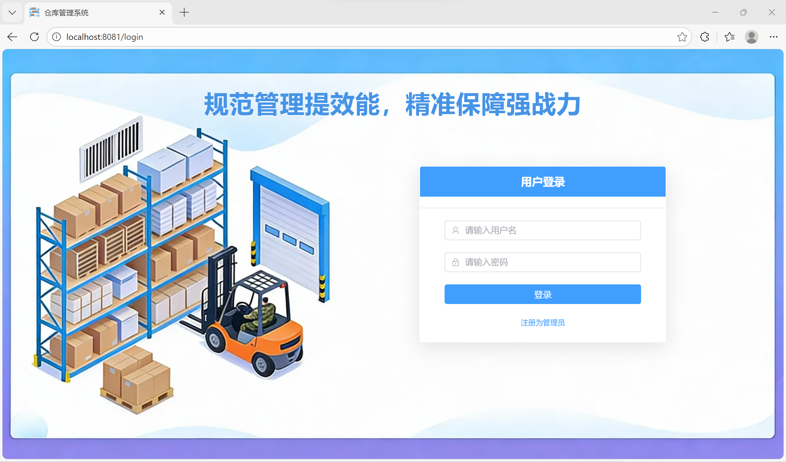

**默认首页**  
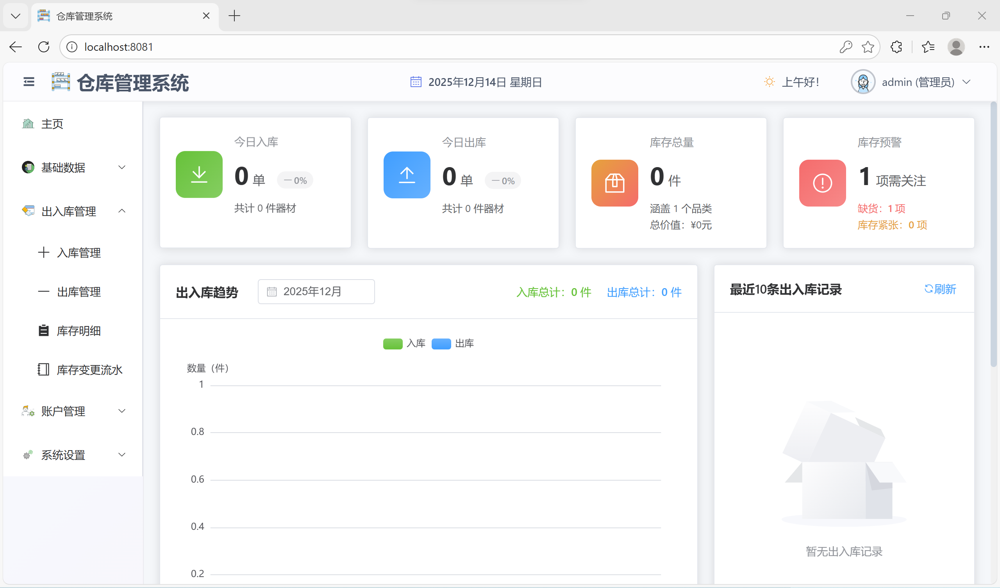

### 基础数据管理

**仓库配置**  
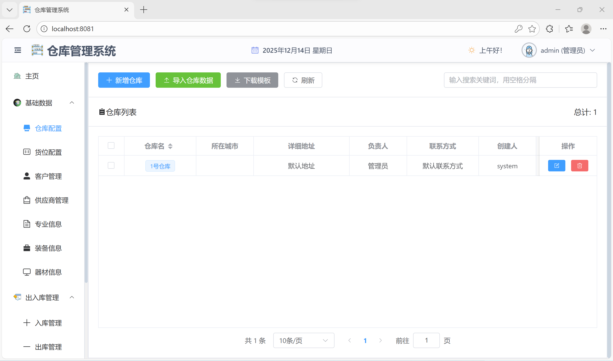

**货位配置**  
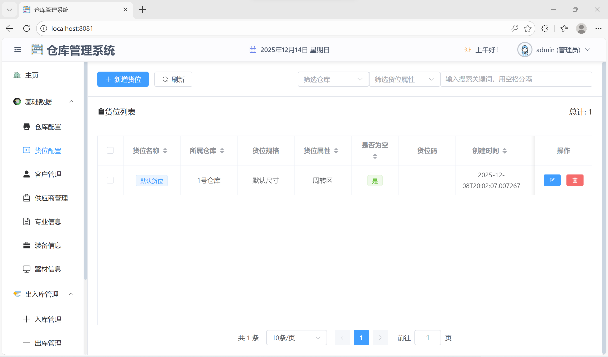

**专业管理**  
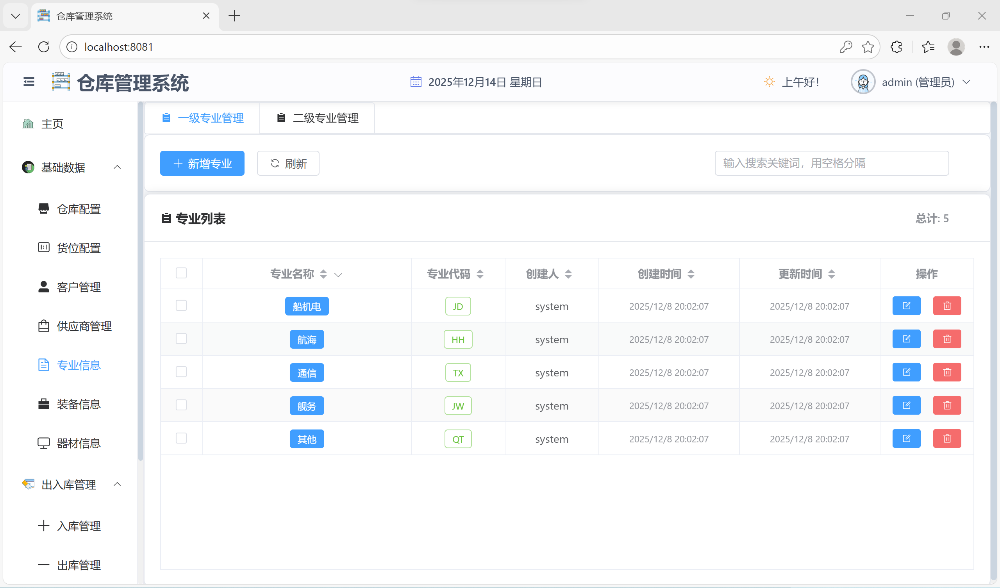

**客户管理**  
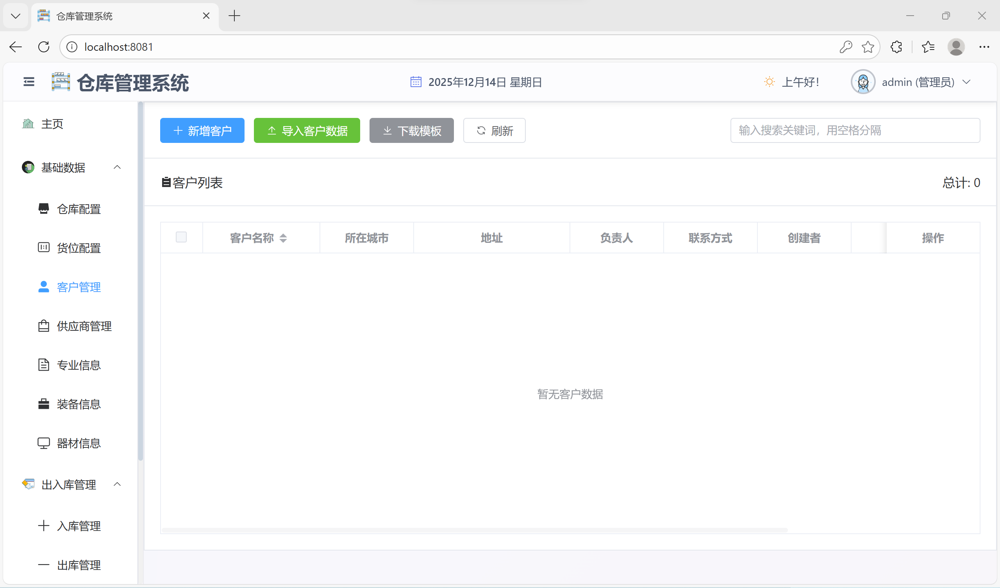

**供应商管理**  
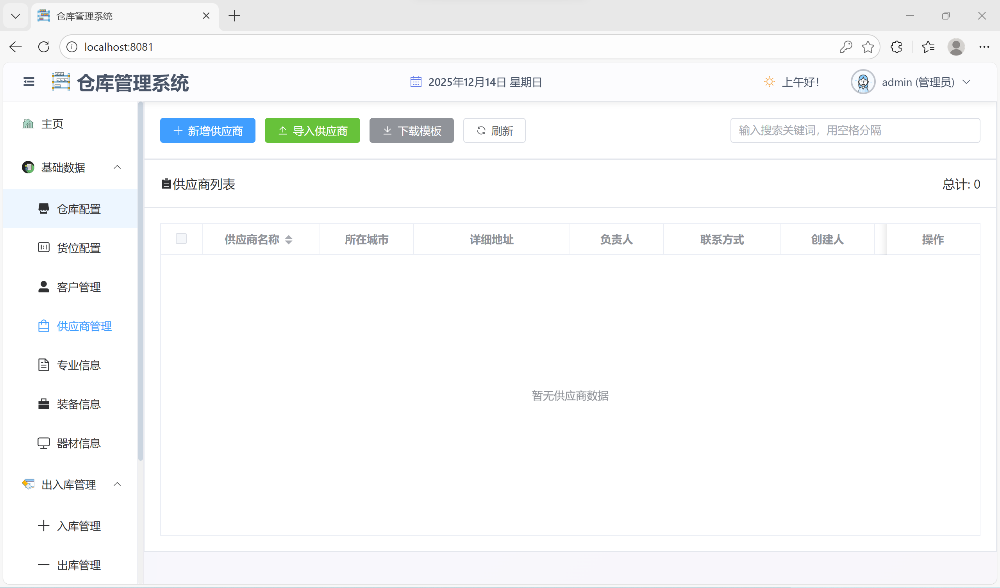

**器材信息**  
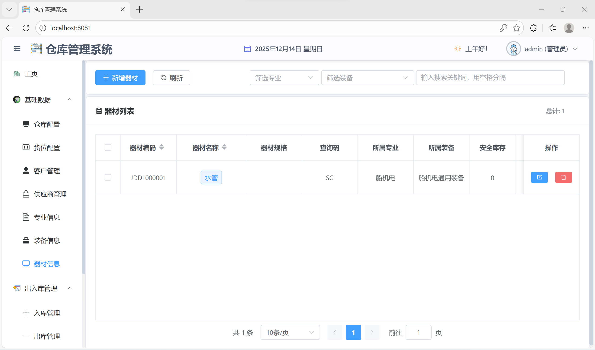

### 库存管理

**入库管理**  
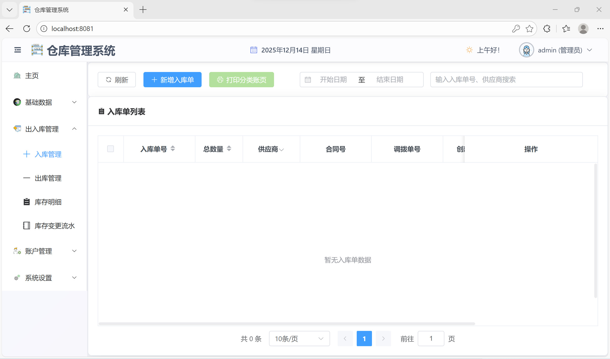

**出库管理**  
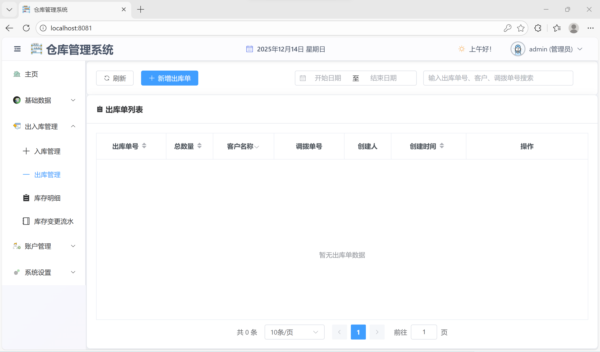

**库存明细**  
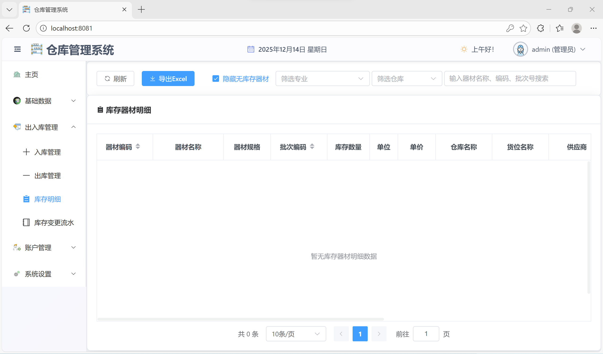

**库存变更流水**  


### 账户管理
**权限管理**  
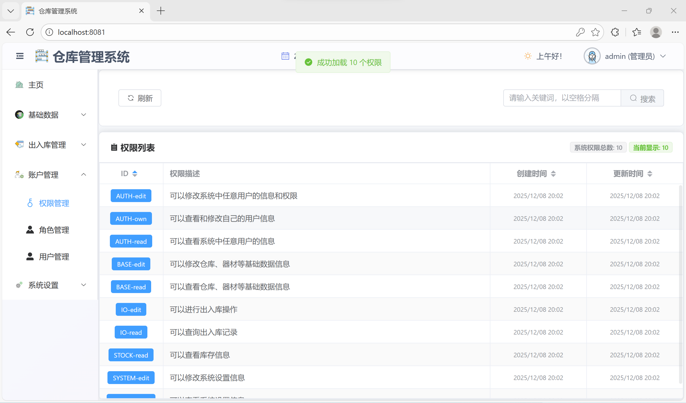

**角色管理**  
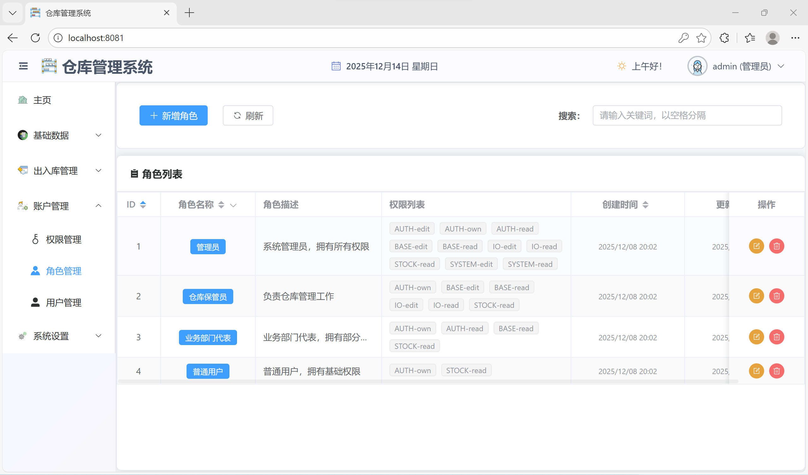

**用户管理**  
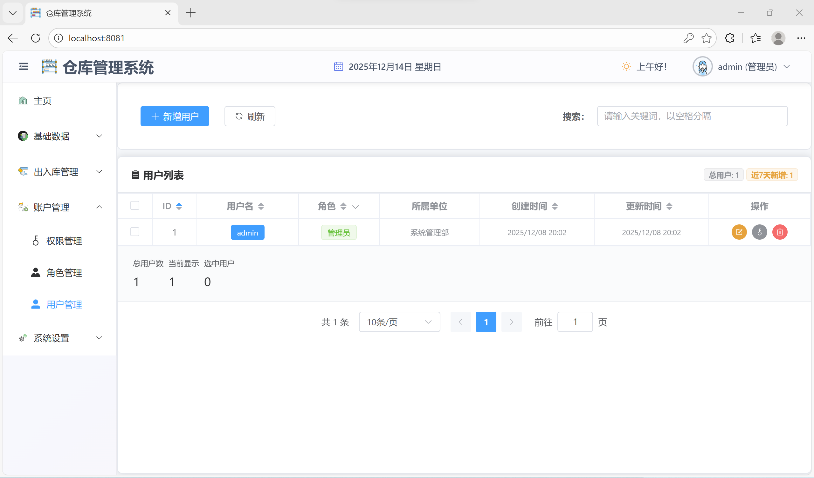

### 系统设置
**数据库管理**  
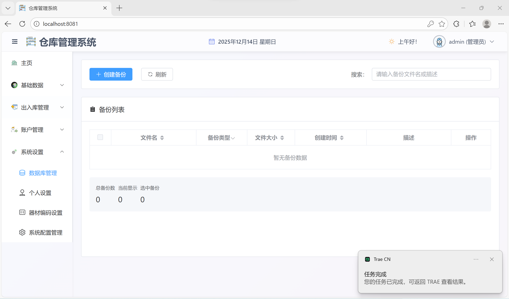

**器材编码设置**  
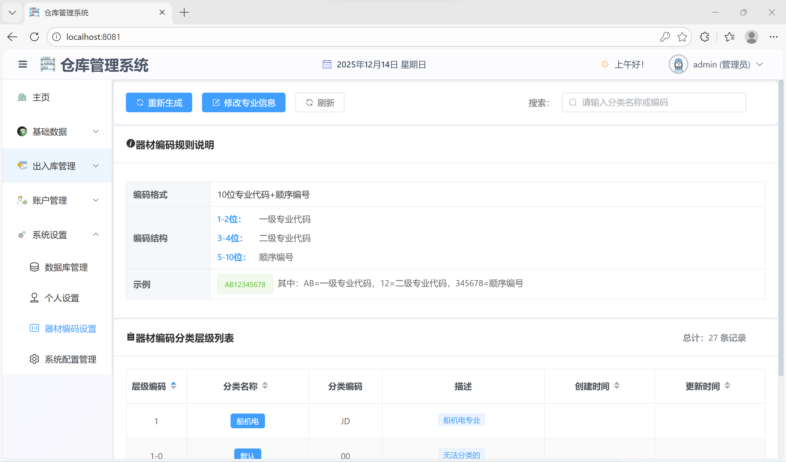

**个人设置**  
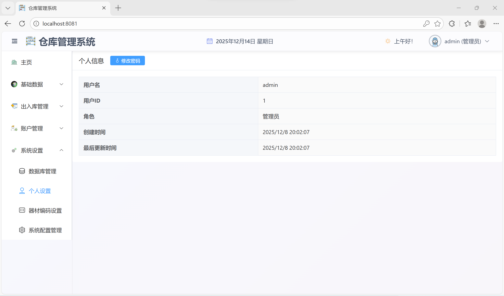

**系统配置管理**  
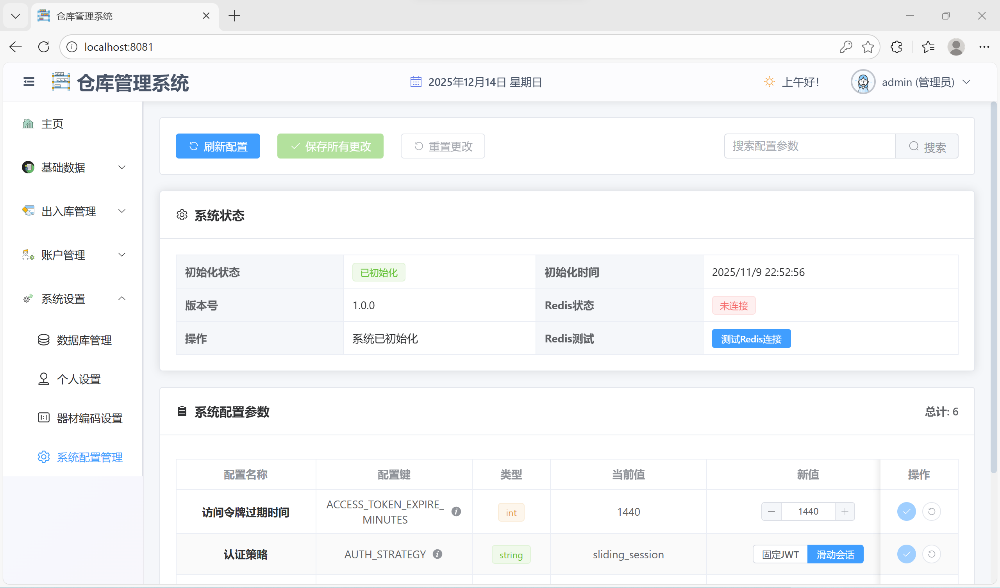

## 3.技术栈

**后端技术栈:**
- **框架**: FastAPI + SQLModel
- **数据库**: SQLite (主业务数据库 + 系统配置数据库)
- **认证**: JWT (OAuth2 Bearer Token)
- **缓存**: Redis
- **容器化**: Docker
- **其他**: Pydantic、bcrypt、fpdf2等

**前端技术栈:**
- **框架**: Vue 3 + TypeScript
- **UI组件**: Element Plus
- **路由**: Vue Router
- **状态管理**: Pinia
- **构建工具**: Vite
- **图表**: ECharts

## 4.项目结构

```
WarehouseManagement/
├── backend/                 # 后端服务
│   ├── backup/             # 备份管理模块
│   ├── config/             # 配置文件
│   ├── core/               # 核心组件（安全、配置、日志等）
│   ├── database/           # 数据库管理
│   ├── initialize/         # 系统初始化
│   ├── models/             # 数据模型
│   ├── routes/             # API路由
│   ├── schemas/            # Pydantic模式
│   ├── utils/              # 工具函数
│   └── main.py             # 应用入口
├── frontend/               # 前端应用
│   ├── src/
│   │   ├── components/     # Vue组件
│   │   ├── services/       # API服务
│   │   ├── stores/         # 状态管理
│   │   └── router/         # 路由配置
│   └── package.json
├── warehouseBackend/       # 数据存储目录
│   ├── data/              # 数据库文件
│   ├── logs/              # 日志文件
│   └── backups/           # 备份文件
└── docker-compose.yml     # Docker编排配置
```

## 5.主要功能模块

### 5.1 用户认证与权限管理
- **用户注册/登录**: OAuth2密码模式认证
- **权限控制**: 基于角色的权限管理系统
- **会话管理**: JWT令牌认证
- **用户管理**: 用户信息维护、权限分配

### 5.2 基础数据管理
- **仓库管理**: 多仓库配置、仓库信息维护
- **客户管理**: 客户档案管理
- **供应商管理**: 供应商信息管理
- **货位管理**: 仓库货位配置

### 5.3 物料管理
- **器材管理**: 器材基本信息、分类管理
- **专业管理**: 专业分类体系
- **装备管理**: 装备类型管理
- **编码体系**: 器材编码分类层级管理

### 5.4 库存管理
- **入库管理**: 入库单创建、审核、执行
- **出库管理**: 出库单创建、审核、执行
- **库存查询**: 实时库存查询、库存明细
- **库存流水**: 库存变更记录跟踪

### 5.5 系统管理
- **系统配置**: 系统参数配置
- **数据备份**: 自动/手动数据备份
- **数据恢复**: 备份数据恢复功能
- **系统监控**: 系统状态监控、日志管理

### 5.6 报表与统计
- **仪表板**: 关键指标展示
- **统计报表**: 各类业务统计
- **分类账页**: 器材分类账页生成
- **数据导出**: Excel、PDF格式导出

## 6.安装与部署

### 6.1环境要求
- Python 3.13+
- Node.js 18+
- Docker & Docker Compose (推荐)

### 6.2 快速启动 (Docker方式)
下载我编译好的镜像
1. **克隆项目**
```bash
git clone https://gitee.com/wtrw09/warehouse.git
cd WarehouseManagement
```
2. **从Registry中拉取镜像**
```bash
$ docker pull crpi-4rpw1lejokg3alu8.cn-shanghai.personal.cr.aliyuncs.com/wtrw09/warehouse-frontend:latest-amd64
$ docker pull crpi-4rpw1lejokg3alu8.cn-shanghai.personal.cr.aliyuncs.com/wtrw09/warehouse-backend:latest-amd64
$ docker pull crpi-4rpw1lejokg3alu8.cn-shanghai.personal.cr.aliyuncs.com/wtrw09/redis:7.2-alpine-amd64
```
**加载镜像**
```bash
# 在镜像文件所在目录下运行
sudo docker load -i warehouse-backend-arm 64-latest.tar
sudo docker load -i warehouse-frontend-arm 64-latest.tar
sudo docker load -i redis-7.2-alpine-arm 64.tar
# 验证,可以看到载入的镜像
sudo docker images
```

3. **启动容器**
复制docker-compose.yml和start-containers.ps1和start-containers.sh文件到项目根目录你要运行的目录下,Windows系统运行start-containers.ps1,Linux/Mac系统运行start-containers.sh。
注意：Linux中需要给start-containers.sh添加可执行权限。
```bash
$ chmod +x start-containers.sh
```
然后以管理员权限运行start-containers.sh：
```bash
$ sudo ./start-containers.sh
```
4. **访问系统**
`http://localhost:8081/login`或者`http://[你的电脑IP地址]:8081/login`

3. **访问系统**
- 前端应用: http://localhost:8081
- 后端API: http://localhost:8000
- Redis服务: localhost:6379

### 6.3手动部署
1. **克隆项目**
```bash
git clone https://gitee.com/wtrw09/warehouse.git
cd WarehouseManagement
```
**后端部署:**
```bash
cd backend
pip install -r requirements.txt
python main.py
```
**前端部署:**
```bash
cd frontend
npm install
npm run build
npm run dev
```
## 7.系统初始化

系统首次启动时会自动执行初始化流程：
1. 检查数据库连接状态
2. 创建必要的数据库表结构
3. 初始化系统默认数据
4. 启动定时备份调度器
5. 配置字体和日志系统

## 8.数据库架构

系统采用双数据库设计：
- **主业务数据库** (`warehouse.db`): 存储业务数据
- **系统配置数据库** (`system_config.db`): 存储系统配置和权限数据

## 9.权限系统

系统采用基于角色的权限控制(RBAC)模型：

### 9.1 权限层级
1. **系统管理员**: 最高权限，可管理所有功能
2. **仓库管理员**: 管理指定仓库的业务操作
3. **业务部门代表**: 能够查看仓库运行数据，但不能够更改，只有监督作用
4. **查看员**: 仅能够查看库存数据，不能进行任何更改操作，给客户（部门能够申领物资的人）使用

### 9.2 权限分类
- `AUTH-*`: 用户认证相关权限
- `BASE-*`: 基础数据管理权限
- `STOCK-*`: 库存管理权限
- `SYSTEM-*`: 系统管理权限
- `IO-*`: 出入库操作权限

## 10.备份与恢复

### 备份策略
- **定时备份**: 每日自动备份
- **手动备份**: 按需手动创建备份

### 恢复机制
- 支持从备份文件恢复数据
- 提供恢复状态跟踪
- 支持选择性恢复

## 日志管理

系统提供多级别日志记录：
- **应用日志**: 业务操作记录
- **错误日志**: 异常和错误记录
- **调试日志**: 开发调试信息
- **恢复日志**: 备份恢复操作记录

## 11.虚拟机安装部署docker（以almalinux8为例）
如果你的windows系统或电脑硬件不支持虚拟化，无法安装docker，你可以尝试在虚拟机中安装docker。
### 11.1 在虚拟机中安装 almalinux
### 11.2 把用户添加到 sudo 中
```bash
# 1. 切换到 root 用户，首先切换到 root 用户
su -
# 2. 编辑 sudoers 文件，使用文本编辑器（如 vim）打开 /etc/sudoers 文件。
vi /etc/sudoers
# 3. 添加用户到 sudoers 文件，在打开的文件中，找到类似于 root ALL=(ALL) ALL 的行，在其下方添加一行，将 userName 用户添加进去。
root ALL=(ALL) ALL
userName ALL=(ALL) ALL
```
### 11.3 打开网络设置
```bash
# 启动网络文本界面
sudo nmtui
```
### 11.4 安装 OpenSSH 服务器
```bash
# 启动SSH服务 
sudo systemctl start sshd 
sudo systemctl enable sshd 
# 检查服务状态 
sudo systemctl status sshd 
# 查看IP地址（用于连接） 
ip addr show
```
在 VirtualBox 中配置端口转发：
1. 虚拟机设置 → 网络 → 高级 → 端口转发
2. 添加规则：
    - **名称**: SSH
    - **协议**: TCP
    - **主机 IP**: 空
    - **主机端口**: 2222（或其他未占用端口）
    - **子系统 IP**: 空
    - **子系统端口**: 22
### 11.5 从 Windows 主机传输文件
下载 docker-20.10.24.tgz，进行解压，和docker-compose 程序，一起发送到服务器
```bash
# 传输整个文件夹
scp -P 2222 -r 本地文件夹 username@localhost:/home/username/具体目录
```
如果出现错误WARNING: REMOTE HOST IDENTIFICATION HAS CHANGED!
```bash
# 删除localhost:2222的旧密钥记录 
ssh-keygen -R [localhost]:2222
```
### 11.6 安装 docker 和 docker-compose
### 11.6.1 安装 docker
1. 从Docker静态包中复制所有必要的二进制文件 
```bash
sudo cp -f docker/* /usr/bin/
# 设置执行权限 
sudo chmod +x /usr/bin/docker*
sudo chmod +x /usr/bin/containerd* 
sudo chmod +x /usr/bin/ctr 
sudo chmod +x /usr/bin/runc
```
2. 编写containerd.service
```bash
[Unit]
Description=containerd container runtime
Documentation=https://containerd.io
After=network.target

[Service]
ExecStartPre=-/sbin/modprobe overlay
ExecStart=/usr/bin/containerd
Restart=always
RestartSec=5
Delegate=yes
KillMode=process

[Install]
WantedBy=multi-user.target
```

```bash
sudo cp containerd.service /etc/systemd/system/

```
3. 运行 container
```bash
# 测试containerd是否能运行 
sudo /usr/bin/containerd --version
# 启动containerd服务
sudo systemctl daemon-reload
sudo systemctl start containerd
sudo systemctl enable containerd
```

4.  编写docker.service
```bash
[Unit]
Description=Docker Application Container Engine
Documentation=https://docs.docker.com
After=network-online.target firewalld.service
Wants=network-online.target

[Service]
Type=notify
ExecStart=/usr/bin/dockerd
ExecReload=/bin/kill -s HUP $MAINPID
TimeoutSec=0
RestartSec=2
Restart=always
StartLimitBurst=3
StartLimitInterval=60s
LimitNOFILE=infinity
LimitNPROC=infinity
LimitCORE=infinity
TasksMax=infinity
Delegate=yes
KillMode=process

[Install]
WantedBy=multi-user.target
```

```bash
sudo cp docker.service /etc/systemd/system/
```

5. 启动Docker服务
```bash
# 重新加载systemd
sudo systemctl daemon-reload
# 启动Docker
sudo systemctl start docker
# 设置开机自启
sudo systemctl enable docker
# 验证安装
docker --version
# 检查Docker版本 
docker --version
```
6. 设置开机启动
```bash
# 启用containerd开机自启
sudo systemctl enable containerd
# 启用Docker开机自启
sudo systemctl enable docker
# 验证是否已启用开机启动
sudo systemctl is-enabled containerd
sudo systemctl is-enabled docker
```
### 11.6.2 离线安装 docker-compose
```bash
# 将下载的文件复制到离线机器，然后执行：
# 重命名为docker-compose
mv docker-compose-linux-x86_64 docker-compose

# 复制到系统路径
sudo cp docker-compose /usr/local/bin/

# 设置执行权限
sudo chmod +x /usr/local/bin/docker-compose

# 创建符号链接（可选）
sudo ln -s /usr/local/bin/docker-compose /usr/bin/docker-compose
```
## 11.7 安装部署程序
### 11.7.1编译镜像文件
1. 使用frontend\build-amd64-offline.ps1 或 frontend\build-arm64-offline.ps1脚本编译前端镜像文件，根据 CPU 构架选择不同脚本，会在生成 frontend\warehouse-frontend-amd64-latest.tar 或 frontend\warehouse-frontend-arm64-latest.tar
2. 使用 backend\build-amd64-offline.ps1 或 backend\build-arm64-offline.ps1脚本编译后端镜像文件，根据 CPU 构架选择不同脚本，会在生成 backend\warehouse-backend-amd64-latest.tar 或 backend\warehouse-backend-arm64-latest.tar
3. 自行下载 redis 镜像，命名为 redis:7.2-alpine-amd64 或者 redis:7.2-alpine-arm64，打包为redis-7.2-alpine-amd 64.tar
4. 根据 cpu 构架，复制到一个文件夹中，把根目录下 docker-compose.yml、start-containers.sh 一起复制进去
### 11.7.2 把文件传输到虚拟机中
```bash
scp -P 2222 -r * cj@localhost:/home/cj/warehouse
```
### 11.7.3 部署

```
#在home目录下新建运行目录
sudo mkdir warehouse
sudo chmod 777 -r warehouse
#启动docker服务
#关闭容器（如果打开的话）
docker-compose down
#删除重复镜像（可选）
docker rmi 镜像名称
# 载入镜像 docker load -i 镜像文件.tar，示例如下：
docker load -i warehouse-frontend-amd64-latest.tar 
docker load -i warehouse-backend-amd64-latest.tar  
docker load -i redis-7.2-alpine-amd 64.tar 
#将文件复制到运行目录】，根据实际使用
cp start-containers.sh  /home/username/warehouse 
cp docker-compose.yml /home/username/warehouse
#设置运行权限
chmod +x start-containers.sh 
#运行脚本
./start-containers.sh 
```
### 11.7.4 使用
###  VirtualBox 端口转发设置
在 VirtualBox 中配置端口转发：
1. 虚拟机设置 → 网络 → 高级 → 端口转发
2. 添加规则：
    - **名称**: SSH
    - **协议**: TCP
    - **主机 IP**: 空
    - **主机端口**: 8081
    - **子系统 IP**: 空
    - **子系统端口**: 8081
访问 localhost:8081 即可访问登录页面，默认管理账号和密码都是admin
## 12.本地运行调试
你需要自己安装redis,设置密码为redis123，端口设置为6379。如果不安装redis,也可运行，可以忽略报错，目前不影响使用。

## 13.许可证
本项目采用MIT许可证。