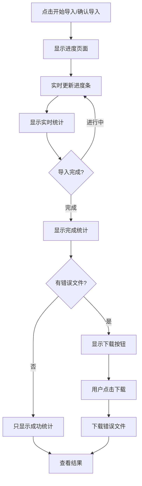

# 增强导入进度页面功能说明

## 功能概述

按照用户需求实现了增强的导入进度页面，在点击"确认导入"或"开始导入"后，显示详细的导入进度信息，包括实时统计、成功/失败数量展示，以及失败时的错误文件下载功能。

## 实现的功能

### 1. 实时进度展示
- **进度条显示**：实时显示导入进度百分比
- **步骤指示器**：显示文件解析、数据验证、批量导入、导入完成四个步骤
- **实时统计**：显示成功、已处理、总计、失败的数量统计

### 2. 导入完成统计
- **结果概览**：通过Alert组件显示导入结果摘要
- **统计卡片**：以卡片形式展示成功导入、总计、失败的具体数量
- **成功率计算**：自动计算并显示导入成功率

### 3. 错误处理与下载
- **错误文件检测**：当后端生成错误文件时自动显示下载区域
- **一键下载**：提供大按钮直接下载包含错误原因的Excel文件
- **下载状态**：显示下载进度和状态提示

## 界面设计

### 导入进行中界面
```
┌─────────────────────────────────────────┐
│ 🔄 仓库数据导入进度    [正在导入数据...]   │
│                                         │
│ ████████████████░░░░  85%               │
│ 85 / 100  正在导入仓库数据...           │
│                                         │
│ ┌─────┐ ┌─────┐ ┌─────┐ ┌─────┐        │
│ │ 78  │ │ 85  │ │100  │ │ 7   │        │
│ │成功 │ │已处理│ │总计 │ │失败 │        │
│ └─────┘ └─────┘ └─────┘ └─────┘        │
│                                         │
│          [取消导入]                     │
└─────────────────────────────────────────┘
```

### 导入完成界面
```
┌─────────────────────────────────────────┐
│ ✅ 仓库数据导入进度    [导入完成]         │
│                                         │
│ ████████████████████ 100%               │
│ 100 / 100  导入完成                     │
│                                         │
│ ⚠️ 仓库数据部分导入成功                  │
│ 成功导入85条数据，15条数据需要修正       │
│ 导入成功率：85.0%                       │
│                                         │
│ ┌─────────┐ ┌─────────┐ ┌─────────┐     │
│ │   85    │ │  100    │ │   15    │     │
│ │ 成功导入 │ │  总计   │ │导入失败 │     │
│ └─────────┘ └─────────┘ └─────────┘     │
│                                         │
│ ⚠️ 错误数据处理                          │
│ 系统已为您生成包含错误原因的数据文件，   │
│ 您可以下载修改后重新导入：               │
│                                         │
│        [📥 下载错误条目文件]             │
│                                         │
│          [查看结果]                     │
└─────────────────────────────────────────┘
```

## 技术实现

### 1. 类型定义扩展
```typescript
export interface ImportProgress {
  current: number;          // 当前处理数量
  total: number;            // 总数量
  percentage: number;       // 百分比
  status: 'uploading' | 'parsing' | 'validating' | 'importing' | 'completed' | 'error';
  message: string;          // 进度消息
  success_count?: number;   // 成功数量（实时更新）
  error_count?: number;     // 失败数量（实时更新）
  has_error_file?: boolean; // 是否生成了错误文件
  error_file_url?: string;  // 错误文件下载链接
}
```

### 2. 核心组件增强

#### ImportProgress.vue
- **实时统计网格**：响应式网格布局展示各项统计数据
- **完成状态展示**：根据成功/失败比例显示不同状态的Alert
- **错误文件下载**：集成下载功能和状态管理

#### UniversalImport.vue
- **进度数据更新**：在导入过程中实时更新统计信息
- **结果数据传递**：将后端返回的详细结果传递给进度组件

### 3. 样式设计
- **统计卡片**：使用不同颜色区分成功、失败、总计等状态
- **错误文件区域**：使用红色背景突出显示错误处理区域
- **响应式布局**：在不同屏幕尺寸下自适应显示

## 用户交互流程



## 后端接口要求

### 1. 批量导入API响应
```typescript
{
  total_count: 100,           // 总记录数
  success_count: 85,          // 成功导入数
  error_count: 15,            // 导入失败数
  errors: [...],              // 错误详情
  import_time: "2024-01-01T10:00:00Z",
  has_error_file: true,       // 是否生成错误文件
  error_file_url: "https://..." // 错误文件下载链接
}
```

### 2. 错误文件格式
- **文件格式**：Excel (.xls/.xlsx)
- **内容结构**：原始数据 + 错误原因列
- **文件名建议**：`{实体名称}导入错误数据.xls`

## 用户体验优化

### 1. 视觉反馈
- **进度动画**：平滑的进度条动画效果
- **状态颜色**：绿色表示成功，红色表示失败，蓝色表示进行中
- **悬停效果**：统计卡片悬停时的阴影效果

### 2. 交互优化
- **实时更新**：导入过程中实时显示统计数据
- **明确指引**：错误处理区域提供清晰的操作指导
- **状态反馈**：下载按钮显示加载状态

### 3. 错误处理
- **容错机制**：下载失败时显示错误提示
- **重试选项**：支持重新下载错误文件
- **状态恢复**：下载完成后恢复按钮状态

## 扩展功能建议

1. **进度估算**：基于处理速度估算剩余时间
2. **取消功能**：支持导入过程中取消操作
3. **日志查看**：提供详细的导入日志查看
4. **批量重试**：支持只重新导入失败的数据

这个增强的导入进度页面为用户提供了完整的导入体验，从开始到完成都有清晰的反馈，特别是对错误情况的处理，让用户能够方便地修复数据并重新导入。