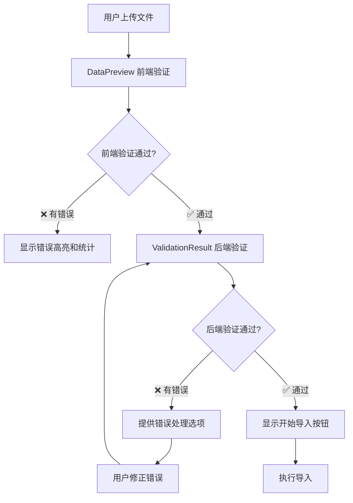

# 数据导入验证分工详细说明

## 🎯 验证职责明确分工

### 📊 **DataPreview.vue** - 前端验证层
> **承担客户端验证职责，提供实时验证反馈**

#### 🔍 验证范围
- ✅ **必填字段验证**: 检查required字段是否为空
- ✅ **数据长度验证**: 检查字段长度是否超出maxLength限制  
- ✅ **数据格式验证**: 基本格式校验（邮箱、手机号等）
- ✅ **数据类型验证**: 数字、日期等类型转换验证
- ✅ **内部重复检查**: 同一导入文件内的重复数据检测

#### 🎨 用户体验
- 🔴 **错误高亮**: 实时标记错误字段
- ⚠️ **警告图标**: 必填字段缺失提示
- 📊 **统计信息**: 显示有效/错误数据数量
- ⚡ **即时反馈**: 用户输入时立即验证

#### 💻 技术实现
```typescript
// 前端验证示例
const validateClientSide = (data: any[], config: ImportConfig) => {
  const errors: ValidationError[] = [];
  
  data.forEach((row, index) => {
    config.templateFields.forEach(field => {
      // 必填验证
      if (field.required && !row[field.key]) {
        errors.push({
          row: index + 1,
          field: field.key,
          message: `${field.label}不能为空`,
          type: 'required'
        });
      }
      
      // 长度验证
      if (field.maxLength && row[field.key]?.length > field.maxLength) {
        errors.push({
          row: index + 1,
          field: field.key,
          message: `${field.label}长度不能超过${field.maxLength}个字符`,
          type: 'length'
        });
      }
    });
  });
  
  return errors;
};
```

---

### 🔍 **ValidationResult.vue** - 后端验证层
> **处理服务端验证结果，确保业务规则完整性**

#### 🏢 验证范围
- ✅ **业务规则验证**: 复杂的业务逻辑校验
- ✅ **数据库唯一性**: 检查数据库中是否已存在
- ✅ **跨表关联验证**: 外键约束、关联数据检查
- ✅ **权限验证**: 用户是否有权限操作特定数据
- ✅ **数据完整性**: 确保数据库约束满足

#### 🎛️ 错误处理策略
- 📝 **在线编辑**: 错误数量少时提供表格内编辑
- 📁 **文件下载**: 错误数量多时生成Excel错误文件
- ⚡ **强制导入**: 允许忽略部分错误强制导入
- 🔄 **重新验证**: 修正数据后重新提交验证

#### 🛠️ 技术实现
```typescript
// 后端验证结果处理
interface ServerValidationResult {
  isValid: boolean;
  errors: ServerValidationError[];
  allowForceImport: boolean;
  errorFileUrl?: string;
}

const handleServerValidation = async (data: any[]) => {
  const result = await api.validateImportData(data);
  
  if (result.errors.length > 0) {
    // 显示错误处理选项
    showValidationErrors(result.errors);
    
    if (result.errors.length <= 5) {
      // 提供在线编辑选项
      enableInlineEdit(result.errors);
    } else {
      // 建议下载文件编辑
      offerFileDownload(result.errorFileUrl);
    }
  } else {
    // 验证通过，显示导入按钮
    showImportButton();
  }
};
```

---

## 🔄 验证流程设计

### 1️⃣ 数据解析阶段
```
ImportUploader → ParsedData[] → DataPreview
```

### 2️⃣ 前端验证阶段  
```
DataPreview 执行客户端验证
├── 基础格式检查
├── 必填字段验证
├── 长度限制检查
└── 内部重复检测
```

### 3️⃣ 后端验证阶段
```
ValidationResult 处理服务端验证
├── 发送数据到后端验证API
├── 接收验证结果
├── 根据错误数量选择处理策略
└── 提供错误修正方案
```

### 4️⃣ 导入执行阶段
```
验证通过 → ImportProgress → ImportResult
```

---

## 🎨 用户体验流程



---

## 🔧 配置化验证规则

### ImportConfig 验证配置
```typescript
interface FieldConfig {
  key: string;
  label: string;
  required?: boolean;           // 前端验证：必填
  maxLength?: number;          // 前端验证：长度
  pattern?: RegExp;            // 前端验证：格式
  type?: 'string' | 'number' | 'date';  // 前端验证：类型
  
  // 后端验证配置
  serverValidation?: {
    unique?: boolean;          // 数据库唯一性
    businessRules?: string[];  // 业务规则验证器
    permissions?: string[];    // 权限检查
  };
}
```

---

## 📋 总结

### ✅ 明确分工
- **DataPreview**: 专门负责前端验证，提供即时反馈
- **ValidationResult**: 专门处理后端验证结果和错误修正

### ✅ 优势互补
- **前端验证**: 减少服务器请求，提升用户体验
- **后端验证**: 确保数据安全性和业务规则完整性

### ✅ 流程清晰
- 前端验证 → 后端验证 → 导入执行
- 每个阶段职责明确，不重复不遗漏

这样的分工确保了验证功能的完整性和用户体验的流畅性！